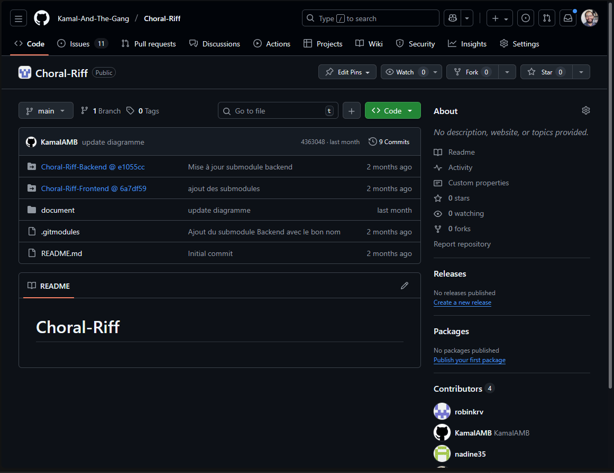

# Déploiement conteneurisé manuel

Cette procédure a pour objectif de détailler les étapes à suivre pour vous permettre de **déployer manuellement une application conteneurisée**.

Compétences abordées :
- utilisation de SSH pour conexion à un serveur ;
- déployer manuellement une composition Docker.

Pré-requis :
- [application web conteneurisée](https://github.com/afpa-learning/stack-spring-react-postgres-docker?tab=readme-ov-file) ;
- client SSH installé sur votre poste de travail (par défaut sur Windows) ;
- [client Git](https://winget.run/pkg/Git/Git) installé sur votre poste de travail ;
- clef SSH publiques ajoutées sur votre serveur et connexion possible ;
- Docker engine installé sur le serveur.

## Etapes à suivre

1. Se connecter au serveur
2. Créer plusieurs clefs SSH pour le serveur
3. Ajouter les clefs de déploiement au différents dépôts
4. Configurer le client SSH du serveur
5. Changer les URL des submodules sur la branche de déploiement du projet global
6. Cloner sur le projet conteneurisé sur le serveur
7. Démarrer la stack conteunerisée

Ces différentes étapes seront détaillées dans la suite de cette procédure.

> [!IMPORTANT]  
> Vous allez partager un serveur à plusieurs.
>
> Il est fort probable que certaines commandes interfèrent avec les autres.
>
> A vous d'échanger et de vous synchroniser pour mener à bien le déploiement. 

### 1 - Connexion en SSH

Pour se connecter au serveur vous pouvez utiliser la commande suivante :
```sh
ssh <user>@<ip>
```

> [!CAUTION]
> A la première connexion pensez à [modifier votre mot de passe](https://linuxize.com/post/how-to-change-user-password-in-linux/#change-your-user-password).

> [!IMPORTANT]  
> Si vous clef SSH n'est pas ajoutée au serveur la connexion se fera pas mot de passe utilisateur.
>
> Il est conseillé d'ajouter votre clef SSH pour pouvoir vous connecter en utilisant ce protocol.
>
> Afin d'ajouter la clef SSH vous pourrez suivre la procédure disponible [ici](https://linuxhandbook.com/add-ssh-public-key-to-server/).

### 2 - Créer plusieurs clefs SSH pour le serveur

L'objectif est de pouvoir récupérer le code du projet à partir d'un dépôt Git.

Pour se faire, vous pouvez créer plusieurs clefs SSH sur le serveur qui nous serviront uniquement pour le déploiement.

> [!WARNING]  
> Ne mettez pas votre clef SSH privée personnelle sur le serveur.
>
> Il vous faut **absolument** recréer des clefs propres au déploiement.
>
> Pour permettre à une machine de récupérer en SSH le code **d'un seul dépôt** Github propose la création de **"clef de déploiement"**.

Pour la création et l'ajout de cette clef de déploiement à votre dépôt vous pourrez vous référer à la [documentation disponible ici](https://docs.github.com/en/authentication/connecting-to-github-with-ssh/managing-deploy-keys#set-up-deploy-keys).

Il vous faut créer **1 clef SSH de deploiement par dépôt**.

Voici, par exemple, l'ensemble des "deploy keys" créées pour un projet avec 3 submodules :
```sh
ubuntu@vps-d1e1d10a:~/.ssh$ ls -al
total 52
drwx------ 2 ubuntu ubuntu 4096 Oct 31 12:24 .
drwxr-x--- 7 ubuntu ubuntu 4096 Oct 31 12:27 ..
-rw------- 1 ubuntu ubuntu    0 Oct 27 06:26 authorized_keys
-rw-rw-r-- 1 ubuntu ubuntu  602 Oct 31 12:24 config
-rw------- 1 ubuntu ubuntu  399 Oct 31 11:45 deploy-back
-rw-rw-r-- 1 ubuntu ubuntu   93 Oct 31 11:45 deploy-back.pub
-rw------- 1 ubuntu ubuntu  399 Oct 31 11:48 deploy-db
-rw-rw-r-- 1 ubuntu ubuntu   91 Oct 31 11:48 deploy-db.pub
-rw------- 1 ubuntu ubuntu  399 Oct 31 11:46 deploy-front
-rw-rw-r-- 1 ubuntu ubuntu   94 Oct 31 11:46 deploy-front.pub
-rw------- 1 ubuntu ubuntu  399 Oct 31 11:47 deploy-global
-rw-rw-r-- 1 ubuntu ubuntu   95 Oct 31 11:47 deploy-global.pub
-rw------- 1 ubuntu ubuntu  978 Oct 31 12:23 known_hosts
-rw-r--r-- 1 ubuntu ubuntu  142 Oct 31 12:21 known_hosts.old
```

Voici un exemple de commande pour créer une clef spécifique nommée "deploy-back" :
```sh
ssh-keygen -t ed25519 -C "deploy-back" -f ~/.ssh/deploy-back
```

> [!IMPORTANT] 
> Il vous est possible de créer des clefs SSH sans passphrase pour faciliter l'opération de récupération du dépôt (clone).

L'idée est de pouvoir utiliser chacune des ces clefs pour chaque submodule (nécessaire car il est impossible d'utiliser plusiers fois la même clef SSH).

Pour que cela fonctionne il faut modifier deux choses :
- la configuration SSH du serveur ;
- la configuration du fichier `.gitsubmodules` (attention de ne le faire que sur la branche prévue pour le déploiement).

Ces opérations seront détaillées dans la suite de cette procédure.

### 3 - Ajouter les clefs de déploiement sur les dépôts

L'ajout d'une clef SSH pour un dépôt Github se fait comme présenté par le Gif ci-dessous :



### 4 - Configurer le client SSH du serveur

**Sur le serveur**, une configuration SSH doit être ajoutée, la voici (ce fichier nommé `config` est contenu dans le dossier `/home/nom-utilisateur/.ssh`) :

```conf
# Clé pour le dépôt principal
Host github.com
    HostName github.com
    User git
    IdentityFile ~/.ssh/deploy-global
    IdentitiesOnly yes

# Clé pour le dépôt de la BDD
Host github.com-db
    HostName github.com
    User git
    IdentityFile ~/.ssh/deploy-db
    IdentitiesOnly yes

# Clé pour le dépôt du backend
Host github.com-back
    HostName github.com
    User git
    IdentityFile ~/.ssh/deploy-back
    IdentitiesOnly yes

# Clé pour le dépôt du frontend
Host github.com-front
    HostName github.com
    User git
    IdentityFile ~/.ssh/deplpy-front
    IdentitiesOnly yes
```

L'objectif de ce fichier est d'associer une clef SSH spécifique à chacune des URL choisie.

Par exemple, la commande `git clone git@github.com-back:MMA-by-AFPA-students/Backend_ScoreManagment.git` est un équivalent de `git@github.com:MMA-by-AFPA-students/Backend_ScoreManagment.git` mais en utilisant la clef SSH nommée `deploy-back`.

### 5 - Changer les URL des submodules sur la branche de déploiement

Pour que la nouvelle configuration SSH puisse être utilisée à partir du serveur il vous faut changer sur la branche **"deploy"** l'URL des submodules dans le fichier `.gitmodules`, voici le nouveau fichier (attention de ne l'avoir que sur la branche "deploy" au risque de casser le "clone" habituel) :

```conf
[submodule "Backend_ScoreManagment"]
	path = Backend_ScoreManagment
	url = git@github.com-back:MMA-by-AFPA-students/Backend_ScoreManagment.git
[submodule "Front_ScoreManagment"]
	path = Front_ScoreManagment
	url = git@github.com-front:MMA-by-AFPA-students/Front_ScoreManagment.git
[submodule "db_scoremanagment"]
	path = db_scoremanagment
	url = git@github.com-db:MMA-by-AFPA-students/db_scoremanagment.git
```

> [!WARNING]  
> Modifiez ces URL uniquement sur une branche spécifique de déploiement sous peine de **CASSER LE MONDE**.

> [!WARNING]  
> Il faut **bien veiller** à ce que toutes les clefs SSH existent dans le dossier `~/.ssh` (cf. partie précédente).

### 6 - Cloner sur le projet conteneurisé sur le serveur

Une fois la configuration SSH en place suivre la procédure suivante pour clone sur le serveur :

1. Clone du dépôt global en SSH :
```sh
git clone <url-ssh>
```

2. Positionnement dans le dossier cloné :
```sh
cd <nom-dossier-projet>
```

3. Changement de branche dans le dépôt global pour obtenir le fichier `.gitsubmodules` modifié avec la nouvelle configuration SSH :
```sh
git switch deploy
```

4. Synchronisation des submodules :
```sh
git submodule sync
```

5. Mise à jour des submodules, si le SSH est correctement configuré les projets seront récupérés :
```sh
git submodule update --init --recursive
```

6. Se positionner dans chacun des submodules et **bien changer de branche** (par défaut Git est en "tête détachée", c'est à dire que nous ne sommes pas sur une branche) :
```sh
cd <dossier-submodule>
git switch <nom-branche-souhaitée>
```

> [!IMPORTANT]  
> Cette procédure correspond à 1 approche particulière basée sur la récupération d'un dépôt Git.
>
> Il existe d'autres façons de transférer des fichiers sur une machine distante.
> Voici, par exemple, une présentation de plusieurs [façons de transférer des fichiers](https://tecadmin.net/transferring-files-over-ssh/).

### 7 - Démarrer la stack conteunerisée

Commande à faire dans le dossier global :
```sh
docker compose up
```

## Commande utiles en bash

### Commande de déplacement/

`cd` : change directory, permet de se déplacer dans un dossier

`cd ..` : permet de se déplacer 1 dossier en arrière dans l'arboresence

`pwd` : "Print Working Directory", affiche le dossier courant

`ls` : list, permet d'afficher le contenu du dossier courant

### Gestion des logiciels

> [!IMPORTANT]  
> le VPS fourni est un système Ubuntu basé sur le gestionnaire de paquets `apt get`
>
> Vous trouverez une liste de commandes utiles pour une maintenance quotidienne en suivant [ce lien](https://geekflare.com/fr/apt-command-examples/).

Voici une sélection :

`apt get install <nom-logiciel>` : le VPS fourni est un système Ubuntu basé sur le gestionnaire de paquets `apt get`

Vous pouvez essayer d'installer un logiciel en utilisant la commande suivante (pour nano, éditeur de texte en ligne de commande) : `apt get install nano`

### Commandes Docker

Vous allez être amenés à manipuler des conteneurs Docker.

Vous trouverez quelques unes des commandes les plus utilisées [dans ce document.](https://dockerlabs.collabnix.com/docker/cheatsheet/)